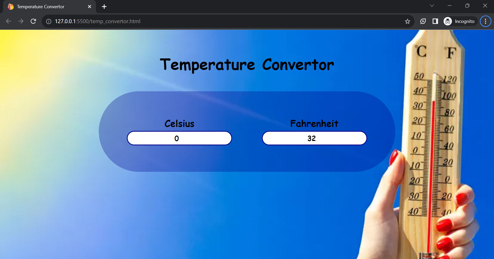
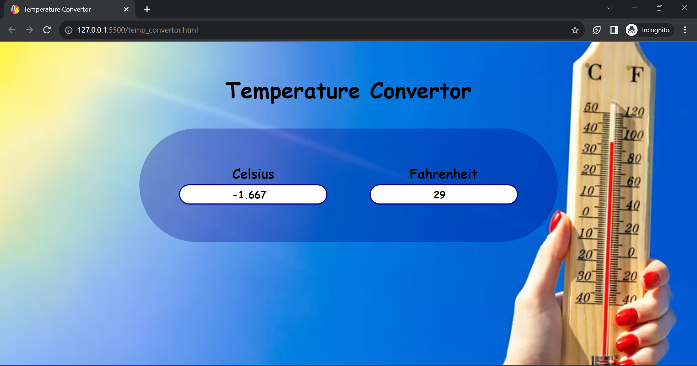

# Temperature Convertor
HTML-5, CSS-3, Vanilla JS ES-6

### Links
https://temperature-convertor-blush.vercel.app/

## Table of contents
- [Overview](#overview)
- [Screenshot](#screenshot)
- [Links](#links)
- [Built with](#built-with)
- [Useful resources](#useful-resources)
- [Author](#author)

## Overview
Introducing my cutting-edge Temperature Converter, powered by HTML5, CSS3, and Vanilla JavaScript! This innovative tool allows you to effortlessly convert temperatures between Celsius and Fahrenheit in real-time, as you type. With a sleek and user-friendly interface, the website provides an accuracy of up to three decimal places, ensuring precision in every conversion. 

### Screenshot
- Default Preview

- Changing the value of temperature

### Built with

- Semantic HTML5 markup
- CSS custom properties
- Flex-box
- Vanilla JS

### Useful resources
- W3schools (https://www.w3schools.com/)
- MDN web Docs (https://developer.mozilla.org/en-US/)

## Author
Priya
- GitHub: (https://github.com/Priya-git21)
- LinkedIn: (https://www.linkedin.com/in/priya-makkar-851973223/)
